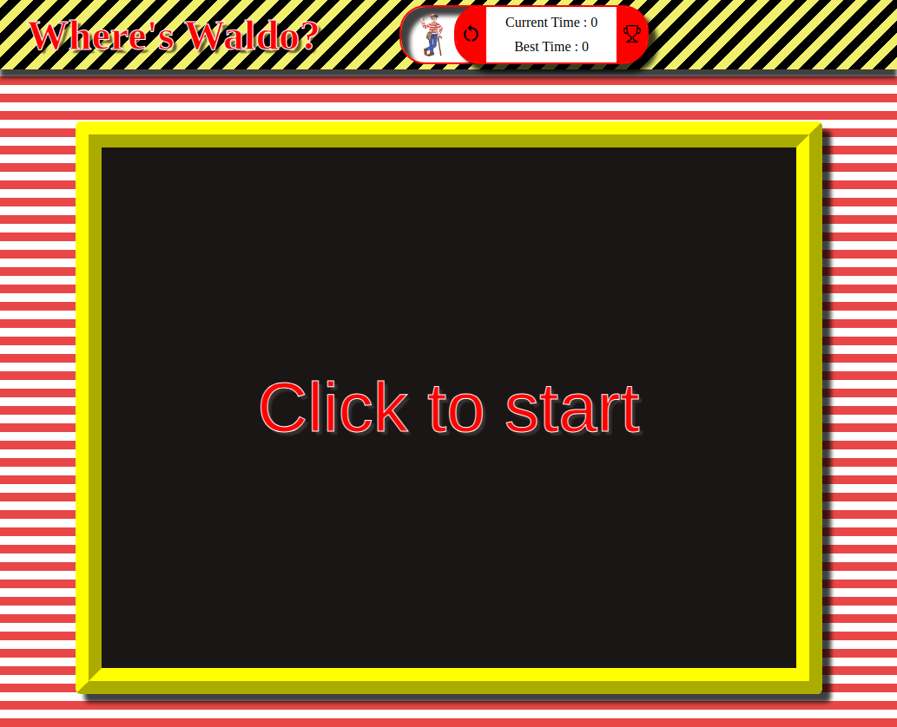

-->
[![Contributors][contributors-shield]][contributors-url]
[![Forks][forks-shield]][forks-url]
[![Stargazers][stars-shield]][stars-url]
[![Issues][issues-shield]][issues-url]
[![MIT License][license-shield]][license-url]
[![LinkedIn][linkedin-shield]][linkedin-url]

<!-- PROJECT LOGO -->
 

  

<h3 align="center">Wheres Waldo</h3>

  

    project_description
     
    <a href="https://github.com/sirjamo1/wheres-waldo"><strong>Explore the docs »</strong></a>
     
     
    <a href="https://sirjamo1.github.io/wheres-waldo/">View Demo</a>
    ·
    <a href="https://github.com/sirjamo1/wheres-waldo/issues">Report Bug</a>
    ·
    <a href="https://github.com/sirjamo1/wheres-waldo/issues">Request Feature</a>
  

<!-- TABLE OF CONTENTS -->

  
Table of Contents

  <ol>
    <li>
      <a href="#about-the-project">About The Project</a>
      <ul>
        <li><a href="#built-with">Built With</a></li>
      </ul>
    </li>
    <li><a href="#roadmap">Roadmap</a></li>
    <li><a href="#contact">Contact</a></li>
    <li><a href="#acknowledgments">Acknowledgments</a></li>
  </ol>

<!-- ABOUT THE PROJECT -->

## About The Project

Wheres Waldo Created for The Odin Project

Features

<ul>
   <li>Timer starts when user clicks start, stops when last character is found.</li>
      <li>Option to submit score to leader board (fireStore).</li>
   <li>Updates best score.</li>
    <li>View leader board.</li>
     <li>Characters fade when found.</li>
      <li>Animation on timer container when starting and finishing.</li>
   <li></li>
</ul>

Assignment Instructions:
 
<ol>
  <li>Set up a GitHub Repo for this project. Follow the instructions atop the Recipes project if you need help.</li>
  <li>Think about what you’ll need to do to get this all working together. This is where it’s really helpful to think it completely through on paper or whiteboard ahead of time! A few minutes of thought can save you from wasting an hour of coding.</li>
  <li>If you’re using Rails as your backend: create a new Rails application with just the bare bones required to load your HTML page for now. If you’ll be using Firebase, this is a good time to create a new Firebase project for this app, and link to the necessary scripts at the bottom of your HTML page.</li>
  <li>Build the front end functionality without actually using any calls to the back end yet. Specifically, that means creating the JavaScript functionality which pops the targeting box and dropdown menu on the screen when the user clicks on the photo and removes it when the user clicks away.</li>
  <li>Now hook up the functionality for validating with your back end whether the user has clicked in the right place for that character.</li>
  <li>Tie it into your front end so you can seamlessly select characters, validate them, and place the appropriate markers on the map if the selection was correct.</li>
  <li>Add in the ability to time the user from when they first load the page and then display their “score” (time) when they successfully identify all characters. Create a popup that asks them to enter their name for the high scores table if they have earned it.</li>
  <li>Play with it!</li>
  <li>Push your solution to GitHub, Heroku, and/or Firebase Hosting and submit it below. This is a serious project, congratulations!</li>
</ol>

(<a href="#readme-top">back to top</a>)

### Built With

-   [![React][react.js]][react-url]
-   FireStore

(<a href="#readme-top">back to top</a>)

<!-- GETTING STARTED -->

## Getting Started

(<a href="#readme-top">back to top</a>)

<!-- ROADMAP -->

## Roadmap

-   Add more maps
-   Change objects to find each round

See the [open issues](https://github.com/sirjamo1/wheres-waldo/issues) for a full list of proposed features (and known issues).

(<a href="#readme-top">back to top</a>)

<!-- CONTACT -->

## Contact

Your Name - James Howells - jam_how@hotmail.com

Project Link: [https://github.com/sirjamo1/wheres-waldo](https://github.com/sirjamo1/wheres-waldo)

(<a href="#readme-top">back to top</a>)

<!-- ACKNOWLEDGMENTS -->

## Acknowledgments

-   Images from clipartmax.com

(<a href="#readme-top">back to top</a>)

<!-- MARKDOWN LINKS & IMAGES -->
<!-- https://www.markdownguide.org/basic-syntax/#reference-style-links -->

[contributors-shield]: https://img.shields.io/github/contributors/sirjamo1/wheres-waldo.svg?style=for-the-badge
[contributors-url]: https://github.com/sirjamo1/wheres-waldo/graphs/contributors
[forks-shield]: https://img.shields.io/github/forks/sirjamo1/wheres-waldo.svg?style=for-the-badge
[forks-url]: https://github.com/sirjamo1/wheres-waldo/network/members
[stars-shield]: https://img.shields.io/github/stars/sirjamo1/wheres-waldo.svg?style=for-the-badge
[stars-url]: https://github.com/sirjamo1/wheres-waldo/stargazers
[issues-shield]: https://img.shields.io/github/issues/sirjamo1/wheres-waldo.svg?style=for-the-badge
[issues-url]: https://github.com/sirjamo1/wheres-waldo/issues
[license-shield]: https://img.shields.io/github/license/sirjamo1/wheres-waldo.svg?style=for-the-badge
[license-url]: https://github.com/sirjamo1/wheres-waldo/blob/master/LICENSE.txt
[linkedin-shield]: https://img.shields.io/badge/-LinkedIn-black.svg?style=for-the-badge&logo=linkedin&colorB=555
[linkedin-url]: https://linkedin.com/in/
[product-screenshot]: images/screenshot.png
[next.js]: https://img.shields.io/badge/next.js-000000?style=for-the-badge&logo=nextdotjs&logoColor=white
[next-url]: https://nextjs.org/
[react.js]: https://img.shields.io/badge/React-20232A?style=for-the-badge&logo=react&logoColor=61DAFB
[react-url]: https://reactjs.org/
[vue.js]: https://img.shields.io/badge/Vue.js-35495E?style=for-the-badge&logo=vuedotjs&logoColor=4FC08D
[vue-url]: https://vuejs.org/
[angular.io]: https://img.shields.io/badge/Angular-DD0031?style=for-the-badge&logo=angular&logoColor=white
[angular-url]: https://angular.io/
[svelte.dev]: https://img.shields.io/badge/Svelte-4A4A55?style=for-the-badge&logo=svelte&logoColor=FF3E00
[svelte-url]: https://svelte.dev/
[laravel.com]: https://img.shields.io/badge/Laravel-FF2D20?style=for-the-badge&logo=laravel&logoColor=white
[laravel-url]: https://laravel.com
[bootstrap.com]: https://img.shields.io/badge/Bootstrap-563D7C?style=for-the-badge&logo=bootstrap&logoColor=white
[bootstrap-url]: https://getbootstrap.com
[jquery.com]: https://img.shields.io/badge/jQuery-0769AD?style=for-the-badge&logo=jquery&logoColor=white
[jquery-url]: https://jquery.com
